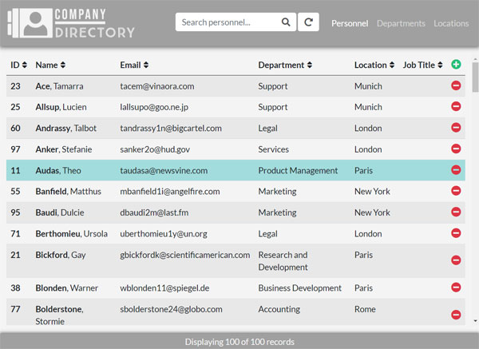
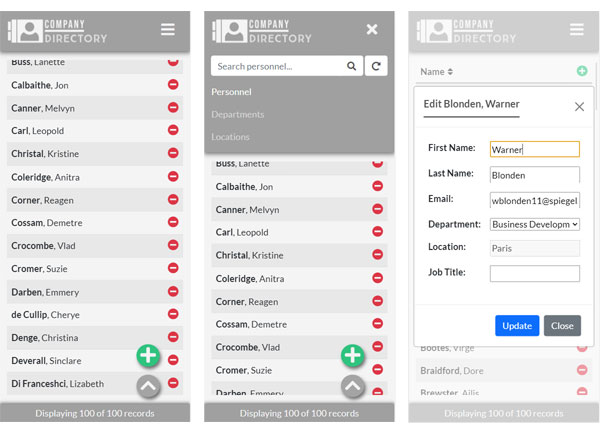
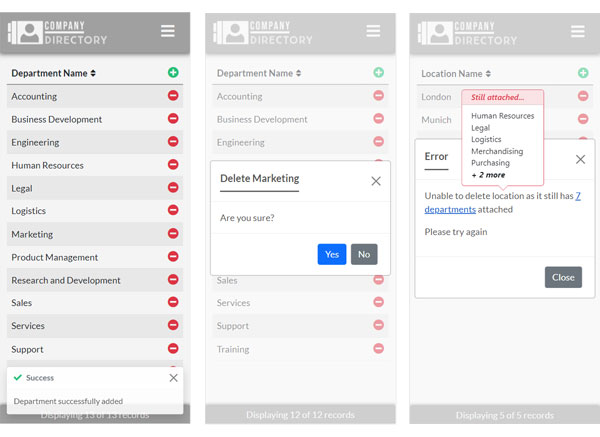

# Company Directory
> A single-page, mobile-first data management web application that asynchronously connects to a server-side relational database, via PHP scripts, in order to fetch, manipulate, display and maintain records.

## Table of contents
* [General information](#general-information)
* [Screenshots](#screenshots)
* [Technologies](#technologies)
* [Setup](#setup)
* [Features](#features)
* [Project status](#project-status)
* [Contact](#contact)

## General information
* A mobile-first single-page data management web application to enable maintenance of a fictional company's personnel data.
* Uses [Bootstrap](https://getbootstrap.com) for a clean, modern, mobile-first responsive design that adapts for larger screens, dynamically changing the number of database columns displayed depending on device screen size.
* JavaScript/[jQuery](https://jquery.com) controlling events in the user interface.
* Client-side asynchronous AJAX calls initiating Create/Read/Update/Delete (CRUD) actions on the server-side database, to maintain a seamless, single-page application experience.
* PHP scripts connecting to a [MariaDB](https://mariadb.org) Relational Database Management System (RDBMS), via Structured Query Language (SQL) queries, to build, sort and return datasets to the client.
* PHP logic managing foreign key relationships between database tables, ensuring referential integrity is respected by preventing deletion of referenced records.
* All user interface interactions (searching, sorting data, etc.) handled through calls back to the server to implement a database connection, enabling better multi-user concurrent interactions.
* Error handling across the application, displaying meaningful error messages in the user interface for failed database connections, inability to retrieve/update data, attempts to violate foreign key constraints, etc.

## Screenshots

## Technologies
* HTML5
* CSS3
* JavaScript
* jQuery
* Bootstrap
* AJAX
* JSON
* PHP
* MariaDB RDBMS
* SQL

## Setup
* Ensure you have an appropriate PHP server and MariaDB database installed and running, e.g. [XAMPP](https://www.apachefriends.org)
* Update *'resources/php/config.php'* with database credentials (database name, username and password).
* Update all PHP files in *'resources/php'* to ensure they 'include' *config.php* from the correct location.
* Run the SQL script from *'resources/sql'* against your MariaDB database to create the relational database for the application to use. Edit where required to ensure the database name matches the credentials used in *'config.php'*.

## Features
* Ability to add, update and delete personnel, department and location data from the Company Directory.
* Click any row to view/update all of an entry's fields.
* Confirmation prompted for all actions before changes are committed to the database.
* Personnel search facility, enabling matches to be found against any personnel data field.
* Ascending/descending alphabetical sorting of all columns displayed across the application.
* Row count to show current number of records being displayed from the total.
* Prevention of related record deletion (e.g. prevent department deletion when there are still personnel attached to it), with error messaging and a preview of the data still attached.
* Dynamically expanding list view to show all columns on larger screens without having to click an entry to view the detail.
* Responsive layout and dropdown navigation menu on mobile.

## Project status
* Complete

## Contact
* Created by Chris Walker
* [chrismwalker.co.uk](https://chrismwalker.co.uk)